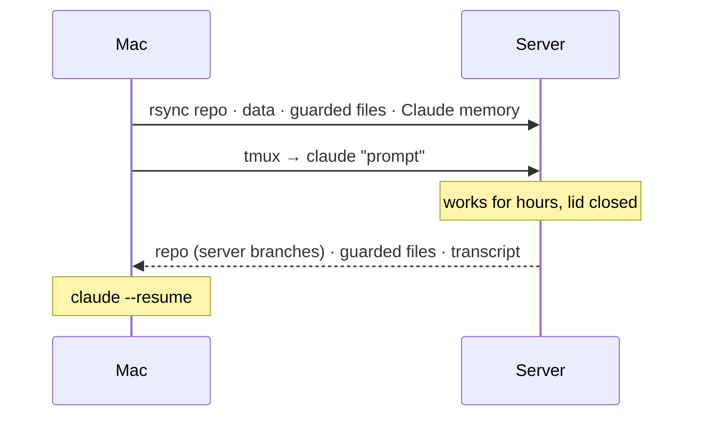

# claude-server-handover

Three Claude Code skills that hand a project to a home server, let Claude keep working there while your laptop is closed, and pull the result and the conversation back.

I turned an old laptop into an Ubuntu box on Tailscale. Before I leave for the day I say "hand this off to my server and finish X". Claude rsyncs the repo (with branches), any data dirs and the one SQLite file I cannot lose, starts itself in tmux on the server and begins on the prompt. Next morning, "bring it back": the server's commits, the changed state and the session transcript come home, and `claude --resume` continues mid-thought. No cloud, no open ports. Before sending, Claude pre-screens the prompt for anything it would otherwise stop and ask about, so the remote session does not sit idle. Files marked as guarded are backed up and never overwritten by an older copy, in either direction.

## Install

```
/plugin marketplace add ThomirEL/claude-server-handover
/plugin install server-handover@claude-server-handover
/server-handover:setup-server
```

Server needs: Linux, Tailscale (or any ssh reachability), key-based ssh, `tmux`, `rsync`, `python3`, and Claude Code logged in. `setup-server` asks once for the server, then once per project what should travel along; that lands in `<project>/.handover.env` (see [`docs/example.handover.env`](docs/example.handover.env)). Without plugins: `git clone` this repo and run `./install.sh`.

## Use

```
hand this off to my server and continue fixing the flaky integration test
```
```
is the server stuck?          →  handover.sh --status
bring it back from the server
```



## Notes

- Guarded files: backup, then refuse to overwrite a newer copy on the other side (`HANDOVER_FORCE=1` overrides), sha256-verified.
- Preflight before every handover: tools missing on the server, no git identity, dirty tree, leftover `HANDOVER-QUESTIONS.md`, missing `.env`. Real judgement calls are asked once, up front, and folded into the prompt. If nothing is ambiguous, nothing is asked.
- The remote session also starts with `--remote-control`, so a leftover question can be answered from claude.ai/code or the phone app. Optional; `HANDOVER_REMOTE_CONTROL=0` turns it off.
- `tests/e2e.sh` runs the whole round trip against your real server.
- Not a deploy tool, not multi-user. One person, two machines, one conversation. MIT.
