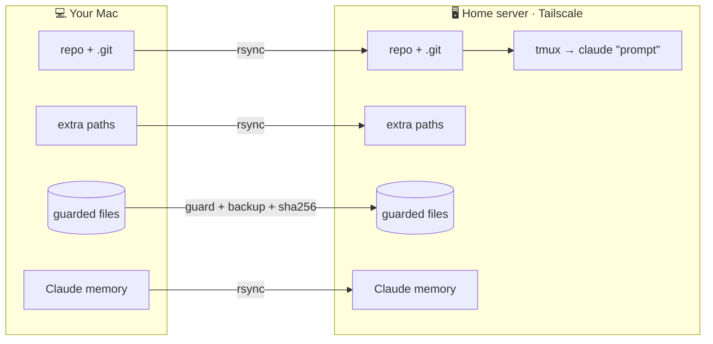
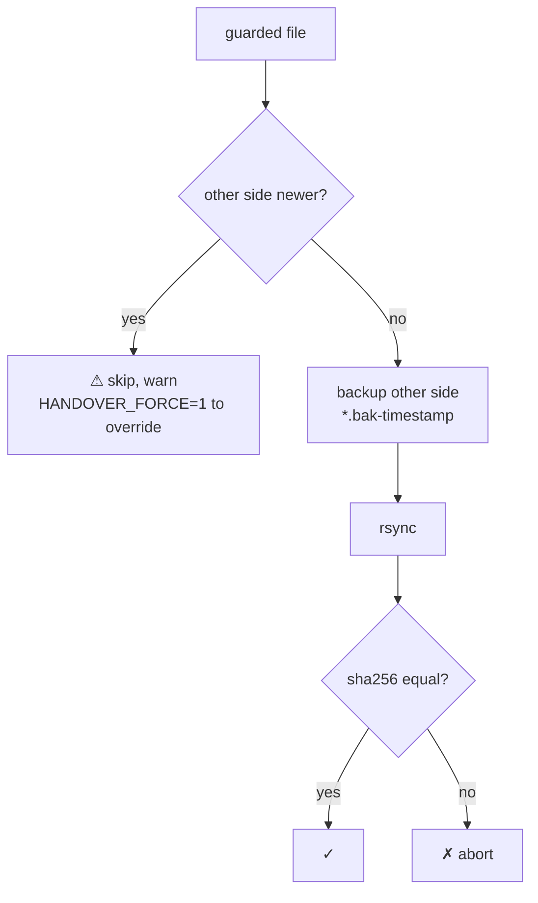
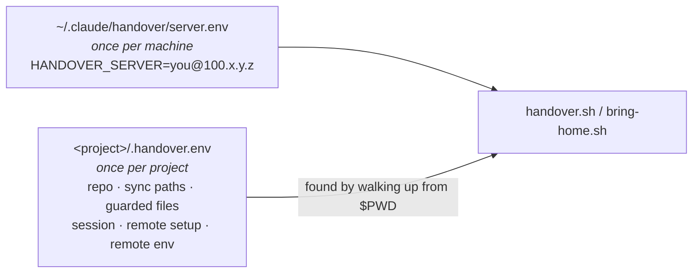

# claude-server-handover

**Hand a Claude Code session to an old laptop at home, let it work while your Mac is closed, pull the finished work — and the conversation — back.**

Three [Claude Code skills](https://docs.anthropic.com/en/docs/claude-code/skills), zero cloud spend:

| Skill | What it does |
|---|---|
| `/setup-server` | Once per machine: which server. Once per project: what to carry across. |
| `/handover-to-server` | Push the project, start Claude in tmux on the server, optionally with a prompt so it begins work immediately. |
| `/bring-home-from-server` | Pull everything back, including branches Claude made and the session transcript, so `claude --resume` continues locally. |

```
you ▸ "hand this off to my server and keep going on the failing tests"
     ▶ code (repo + .git)…
     ▶ guarded ~/.myproj/state.db…      ✓ pushed, sha256 verified
     ▶ remote setup…                    ✓ venv ready
     ▶ launching Claude…
     ✔ Claude is running on you@100.x.y.z in tmux session 'myproj'.
       It has already started on your prompt.
```

## Why

Long Claude Code tasks and a laptop lid do not mix. A ten-year-old laptop running Ubuntu, reachable over [Tailscale](https://tailscale.com), is a perfectly good always-on worker: no cloud bill, no open ports, no public IP. What was missing was a *clean handover* — not just the code, but the irreplaceable state next to it, the project memory, and the conversation itself.

## How it works



Paths are mirrored one-to-one: `/Users/you/repos/x` on the Mac becomes `/home/you/repos/x` on the server. Nothing needs to be renamed on either side.

### The round trip

```mermaid
sequenceDiagram
    autonumber
    participant M as Mac
    participant S as Server
    M->>S: rsync repo, extra paths, memory
    M->>S: guarded files (skip if server copy is newer)
    M->>S: run remote setup (venv, npm ci…)
    M->>S: pre-accept folder trust
    M->>S: tmux new-session → claude "prompt"
    Note over S: Claude works for hours.<br/>Mac lid closed.
    S-->>M: rsync repo (server branches travel)
    S-->>M: guarded files (skip if local copy is newer)
    S-->>M: memory + newest session transcript
    Note over M: cd project && claude --resume &lt;id&gt;
```

### The guard

Some files must never be silently overwritten — a SQLite decisions database, a local ledger, anything without a git history. Declare them as **guarded**. In both directions the driver refuses to overwrite a newer copy, backs up before any overwrite, and verifies the result with sha256.



### Two layers of config



Missing server config → exit **2**. Missing project config → exit **3**. The skills tell Claude to run `/setup-server` and ask you the right questions, so the first handover in a new project is a short conversation, not a config-file hunt.

## Install

### As a plugin (recommended)

Inside Claude Code:

```
/plugin marketplace add ThomirEL/claude-server-handover
/plugin install server-handover@claude-server-handover
```

Skills are then namespaced: `/server-handover:setup-server`, `/server-handover:handover-to-server`, `/server-handover:bring-home-from-server`. Natural language works too ("hand this off to my server").

### As plain skills

```bash
git clone https://github.com/ThomirEL/claude-server-handover.git
cd claude-server-handover && ./install.sh
```

`install.sh` symlinks the three skills into `~/.claude/skills/`, so `git pull` updates them. Use `./install.sh --copy` if you prefer copies.

### Prerequisites

On the **server**: `ssh` with key auth, `tmux`, `rsync`, `python3`, and [Claude Code](https://docs.anthropic.com/en/docs/claude-code) logged in. On the **Mac**: `rsync`, `python3`, `shasum` (all preinstalled).

Then, in Claude Code:

```
/setup-server
```

…or without Claude:

```bash
<skills>/setup-server/setup-server.sh server --host you@100.x.y.z
<skills>/setup-server/setup-server.sh project --dir ~/repos/myproj --guarded "~/.myproj/state.db"
```

where `<skills>` is `~/.claude/skills` for a manual install, or the plugin's `skills/` directory.

## Use

From inside the project, in Claude Code:

> hand this off to my server and continue fixing the flaky integration test

Claude runs the driver and hands you the attach command:

```bash
ssh -t you@100.x.y.z 'tmux attach -t myproj'
```

Later, from any machine with the skills installed:

> bring it back from the server

```
✔ Work pulled back to this machine.
  Continue here:
      cd '/Users/you/repos/myproj' && claude --resume 6f1c…
```

Scripts work standalone too: `plugins/server-handover/skills/handover-to-server/handover.sh "prompt"` and `…/bring-home-from-server/bring-home.sh`.

## Project config reference

See [`docs/example.handover.env`](docs/example.handover.env). Every field is optional; `HANDOVER_REPO='.'` alone is a valid config.

| Field | Meaning |
|---|---|
| `HANDOVER_REPO` | git repo to mirror with `.git` (relative to launch dir or absolute) |
| `HANDOVER_SYNC_PATHS` | extra dirs/files under `$HOME`; Mac canonical on push, server on pull |
| `HANDOVER_GUARDED_FILES` | irreplaceable files: guard + backup + sha256, both directions |
| `HANDOVER_SESSION` | tmux name (default: launch dir basename; auto `-2`, `-3`) |
| `HANDOVER_REMOTE_SETUP` | shell run in the remote repo before launch; keep it idempotent |
| `HANDOVER_REMOTE_ENV` | `KEY=value` pairs exported into the remote Claude; `~` remapped |
| `HANDOVER_EXCLUDES` | extra rsync excludes |

Runtime knobs: `HANDOVER_FORCE=1`, `HANDOVER_SKIP_SETUP=1`, `HANDOVER_ATTACH=1`, `BRINGHOME_SKIP_GUARDED=1`, `BRINGHOME_DEST_PREFIX=/tmp/x` (dry-run the pull into a scratch dir), `HANDOVER_PROJECT_CONFIG=/path/.handover.env`.

## Things that bit me (and are handled)

- **Trust dialog.** A Claude profile that has never seen the folder stops at *"Is this a project you trust?"* and the injected prompt never runs. The driver pre-sets `hasTrustDialogAccepted` for the launch dir in the server's `.claude.json`.
- **Quoting through ssh → tmux → bash.** The prompt is written to a file on the server and read back with `claude "$(cat …)"`. No escaping games.
- **tmux name collisions.** Auto-increments instead of clobbering an existing session.
- **Non-interactive shells.** Ubuntu's `.bashrc` returns early for non-interactive shells, so nothing you defined there exists. The launcher exports what it needs itself.
- **Non-ASCII paths** (`ø`, spaces) survive end to end; Claude's per-project slug is computed separately on each side.
- **macOS bash 3.2 + UTF-8.** `"$f…"` makes bash 3.2 read the ellipsis bytes as part of the variable name and abort under `set -u`. Every variable followed by a non-ASCII character is braced (`${f}…`), and the e2e test runs under `/bin/bash` with `LANG=en_US.UTF-8` on purpose.
- **No git identity on a fresh server.** Remote Claude's first commit fails and it stops to ask. The driver copies your local `user.name`/`user.email` into the remote repo (repo-local) when missing.
- **Newer state on the other side.** The whole reason for the guard. See above.

## Tests

`tests/e2e.sh` runs the whole round trip against your real server: creates a tiny markdown project, hands it over with a prompt, waits for the remote Claude to edit and commit, pulls it back, and asserts the edit, the commit, the guarded file, the backup, the transcript and both guard directions. Needs `server.env` configured. Cleans up the server; leaves the demo project locally so you can `claude --resume` into the server's conversation.

## Related work (and why this exists)

- [Remote Control](https://code.claude.com/docs/en/remote-control) (official) lets you reach a running session from your phone or browser. The process must stay alive on the machine that started it; close the laptop and it goes offline. It solves *access*, not *moving the work*.
- [anthropics/claude-code#31992](https://github.com/anthropics/claude-code/issues/31992) asks for cross-machine session resume. Open, no official answer yet. This repo is a working one for the two-machine case.
- [claude-code-sync](https://github.com/perfectra1n/claude-code-sync), [claude-sync](https://github.com/baptisterajaut/claude-sync), [claude-code-migrate](https://github.com/emreonal11/claude-code-migrate) sync transcripts or `~/.claude` config between machines. None move the project or start Claude remotely.
- [claude-session](https://github.com/kshartman/claude-session) launches Claude in tmux with a prompt and tracks sessions in MongoDB. No code or state sync, no return trip.

What none of them do, and this does: the **project travels** (repo with branches, data, guarded state), Claude **starts working immediately**, and the **conversation comes home** for `claude --resume`.

## Non-goals

Not a deployment tool, not a backup tool, not multi-user. One person, two machines, one conversation.

## License

MIT
